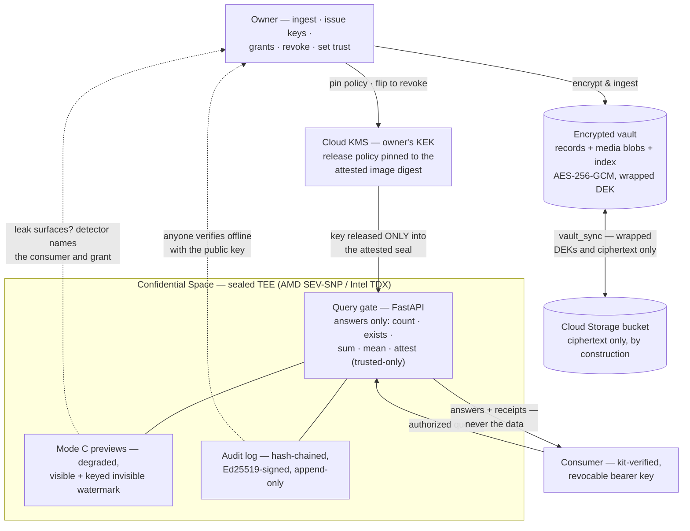
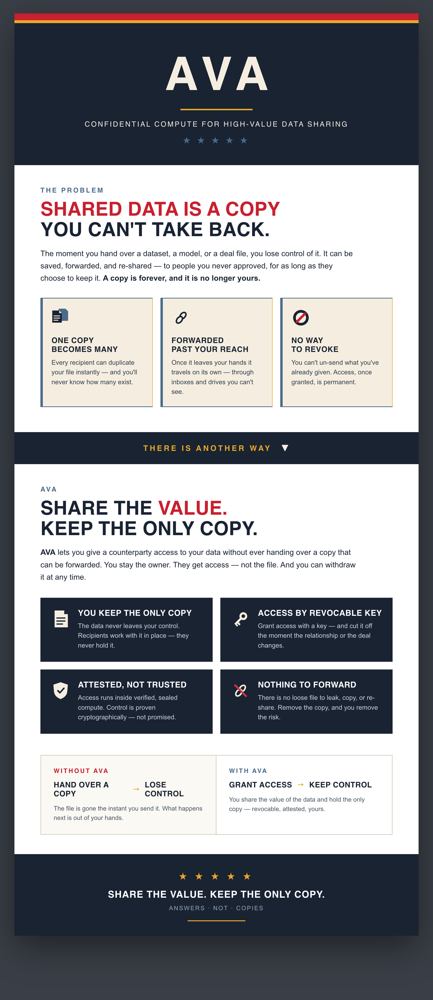

# AVA

**Share the value. Keep the only copy.**

AVA is a sealed query gate for customers who need to provide **total
security for highly confidential information** — and still put that
information to work. The owner keeps the only copy, encrypted. Everyone
else gets **answers**, computed inside a sealed environment, through a key
the owner can **revoke at any time**.

---

## 🛠 Stack

> **By design, an answers-only system**: there is no endpoint that returns
> records, files, or identifiers — consumers receive verified answers and
> cryptographic receipts to integrate into their own systems, never the data.

| Layer | Technology |
|---|---|
| **Query gate** | FastAPI + uvicorn · closed query set (`count` · `exists` · `sum` · `mean` · trusted-only `attest`) · Mode C `/preview` under time-boxed, per-consumer grants · every response carries an audit receipt |
| **Vault & crypto** | AES-256-GCM per record and per media object (fresh nonces, AAD-bound) · envelope encryption — data keys wrapped by the KEK · closed five-class media taxonomy (video, audio, tabular, unstructured, gis) with per-class disclosure rules |
| **Key release** | **The swappable seam** (`make_key_release`): `LocalMockKMS` for dev · `CloudKMSKeyRelease` (google-cloud-kms, lazy + injectable client) for production — a KMS refusal is the owner's infrastructure-layer kill switch · interface shaped for an open-source KBS swap |
| **Attestation target** | Google Cloud **Confidential Space** (AMD SEV-SNP / Intel TDX) · KEK release policy bound to a cosign-signed container digest · ordered bring-up in `scripts/gcp/00–06` |
| **Audit** | Hash-chained, Ed25519-signed append-only log · verifiable offline by anyone holding the public key — no vault access, no secrets |
| **Provenance** | Merkle commitments over matched sets (`attest`) · offline single-object membership proofs |
| **Leak tracing** | Visible per-consumer watermark + keyed **blind invisible tracemark** (HMAC-seeded, winsorized-correlation detector) · owner-side `detect_watermark.py` names the consumer and grant · self-attacking removal drill |
| **Consumer kit** | `kit/ava_verify.py` — stdlib-only (bare python3, no packages): reachability → audit-key fingerprint cross-check → first query, before trusting anything |
| **Storage** | Local-first vault · `vault_sync.py` to Cloud Storage — the sync walks only the vault directory, so registries, grants, audit log, and keys **cannot** travel |
| **Testing** | pytest — 102 tests including named invariants (answers-only leak tripwire, no-plaintext-on-disk with base64-impossible markers, sync scope, watermark survival) and drills (timed revocation, watermark attack battery, 12-stage synthetic dry run) |

## 🗺 System at a Glance



**The pitch, on one page:** [examples/AVA_one_pager.html](examples/AVA_one_pager.html) ([PNG](examples/AVA_one_pager.png))

<p align="center">
  
</p>

---

## The problem — shared data is a copy you can't take back

The moment you hand over a dataset, a model, or a deal file, you lose
control of it. It can be saved, forwarded, and re-shared — to people you
never approved, for as long as they choose to keep it. **A copy is
forever, and it is no longer yours.**

| | |
|---|---|
| **One copy becomes many** | Every recipient can duplicate your file instantly — and you'll never know how many copies exist. |
| **Forwarded past your reach** | Once it leaves your hands it travels on its own, through inboxes and drives you can't see. |
| **No way to revoke** | You can't un-send what you've already given. Access, once granted, is permanent. |

## The answer — grant access, keep control

AVA lets you give a counterparty access to what your data *says* without
ever handing over a copy that can be forwarded. You stay the owner. They
get answers — not the file. And you can withdraw access at any time.

| | |
|---|---|
| **You keep the only copy** | The data never leaves your custody. It sits encrypted at rest; consumers work against it in place and never hold it. |
| **Access by revocable key** | Every consumer gets their own key — and you can cut any one of them off the moment the relationship or the deal changes. Revocation takes effect within one request. |
| **Attested, not trusted** | Queries run inside verified, sealed compute (a hardware TEE). The decryption key is released only to the exact, cryptographically attested code — control is proven, not promised. |
| **Nothing to forward** | There is no loose file to leak, copy, or re-share. Remove the copy, and you remove the risk. |

**Without AVA:** hand over a copy → lose control. The file is gone the
instant you send it; what happens next is out of your hands.

**With AVA:** grant access → keep control. You share the value of the
data and hold the only copy — revocable, attested, yours.

---

## What this repo is

The v1 workload: the query gate that runs inside a Google Cloud
**Confidential Space** TEE, plus the owner-side tooling and GCP
provisioning scripts. It runs fully **local-first** (mock key release),
so the whole flow is testable before any cloud project exists.

## Requirements

**Local mode (the whole quickstart below) needs only Python 3.9+** — no
cloud account, no credentials, no Docker, nothing leaves your machine. Key
release is mocked (`AVA_MODE=local`, the default). This is enough to
explore the entire flow: ingest, query, previews, grants, watermarking,
audit, and the drills. (3.12 is what the container uses; `pip install`
pulls ~200 MB, including the Google Cloud client libraries, which are
imported only in enclave mode.)

**Enclave / production mode is a separate lift** — the quickstart will
*not* give you a hardware-attested deployment. To get real attested key
release (`AVA_MODE=enclave`) you need:

- A **dedicated Google Cloud project** (the scripts refuse to run without
  an explicit `AVA_PROJECT_ID`), with billing enabled.
- These APIs enabled: **Confidential Computing, Cloud KMS, Cloud Storage,
  Artifact Registry, IAM/STS** (`scripts/gcp/01_apis.sh` does this).
- A region/zone offering **Confidential Space** on **AMD SEV-SNP or Intel
  TDX** — Confidential VMs aren't available everywhere; check before you
  pick a region.
- **`gcloud` installed and authenticated**, plus Application Default
  Credentials for owner-side KMS calls
  (`gcloud auth application-default login`).
- **cosign** to sign the container image, whose digest the KMS release
  policy is pinned to.

Without those, `AVA_MODE=enclave` fails at the first KMS call **by
design** — the vault cannot be decrypted outside an authorized identity.
See `scripts/gcp/README.md` for the ordered bring-up.

## Quickstart (local dev — Python 3.9+, nothing else)

```bash
python3 -m venv .venv && .venv/bin/pip install -r requirements.txt
.venv/bin/python -m pytest tests/ -q               # 102 tests

.venv/bin/python scripts/generate_synthetic.py --n 500   # encrypted vault
.venv/bin/python scripts/issue_consumer_key.py --id consumer-001 --label "Pilot"
./scripts/run_local.sh                                # gate on :8080
```

Query it (answers only — there is no endpoint that returns records):

```bash
curl -s localhost:8080/query \
  -H "Authorization: Bearer <key>" -H "Content-Type: application/json" \
  -d '{"type":"count","category":"alpha","ts_from":"2026-01-01"}'
```

Multimodal media (five classes: video, audio, tabular, unstructured, gis).
Point `--path` at your own media directory; to try it immediately, generate
a synthetic batch first:

```bash
.venv/bin/python scripts/generate_synthetic_media.py --dir batch    # 6 files, all 5 classes
.venv/bin/python scripts/ingest_media.py --path batch/ --zone zone-03 --category alpha
curl -s localhost:8080/query -H "Authorization: Bearer <key>" -H "Content-Type: application/json" \
  -d '{"target":"media","type":"count","media_type":"gis"}'   # answers over the index
```

Cryptographic commitments (`"type":"attest"`) are **trusted-only**: an
owner-granted, per-consumer privilege (`scripts/set_trusted.py`), because
commitments confirm dataset size and shape over time.

Degraded, watermarked previews under a time-boxed grant:

```bash
.venv/bin/python scripts/issue_grant.py --consumer-id consumer-001 --hours 48 --zone zone-03
curl -s localhost:8080/preview -H "Authorization: Bearer <key>" -H "Content-Type: application/json" \
  -d '{"grant_id":"<uuid>","limit":3}'
.venv/bin/python scripts/revoke_grant.py --grant-id <uuid>    # preview gone, one request
```

Every image preview also carries a keyed **invisible** fingerprint
(`app/tracemark.py`). If a copy surfaces where it shouldn't:

```bash
.venv/bin/python scripts/detect_watermark.py --image leaked.jpg   # names consumer + grant
.venv/bin/python scripts/drill_watermark_removal.py               # attack our own mark, honestly
```

Provenance without exposure (owner proves, consumer verifies offline):

```bash
.venv/bin/python scripts/prove_membership.py --object-id <uuid> --media-type gis > proof.json
.venv/bin/python scripts/verify_membership.py --proof proof.json --root <attested root>
```

Onboarding a consumer — hand them [kit/](kit/) (a one-page how-to plus a
verifier that runs on bare python3, no packages) together with
`keys/audit_signing.pub` and their key:

```bash
python3 kit/ava_verify.py --gate http://127.0.0.1:8080 --key ava_... --audit-pub audit_signing.pub
```

The owner's switch, and the proof trail:

```bash
.venv/bin/python scripts/revoke_consumer.py --id consumer-001   # 403 within one request
.venv/bin/python scripts/verify_audit.py                        # chain + signatures
.venv/bin/python scripts/drill_revocation.py                    # measure it, log the number
```

## Architecture

| Piece | Here | In enclave mode |
|---|---|---|
| Encrypted vault | `app/vault.py` — AES-256-GCM per record, DEK wrapped | ciphertext in Cloud Storage (`scripts/vault_sync.py`) |
| Key release | `app/keyrelease.py` — **the swappable seam** | Cloud KMS, released only on attestation |
| Query gate | `app/main.py` + `app/queries.py` — answers only | same container, pinned by digest |
| Consumer keys | `app/consumers.py` — hashed, revocable, per-consumer trust flag | + hardware binding (planned) |
| Audit log | `app/auditlog.py` — hash-chained, Ed25519-signed | same; key born inside the TEE |
| Provisioning | — | `scripts/gcp/00–06` |

**Modes.** `AVA_MODE=local` (default): mock KMS, dev only, no protection
claimed. `AVA_MODE=enclave`: Cloud KMS + attestation — the deploy target.
The code path difference is exactly one constructor (`make_key_release`),
so an open-source key broker (e.g. a Trustee KBS client) can replace
Cloud KMS at the same seam.

**Answers only.** Query types are a closed set (`count`, `exists`, `sum`,
`mean`, plus trusted-only `attest`). Adding one is a security decision.
`tests/test_gate.py::test_answers_only_no_record_leakage` is the
regression tripwire, and the suite includes named tests for
no-plaintext-on-disk, no-identifier-leak, sync-scope, and
watermark-survival invariants.

## Stated plainly (limitations)

This is not DRM magic. A human who is shown a value can still relay it —
AVA minimizes, watermarks, and logs what is shown, but a viewed value
cannot be made un-relayable. The hardware trust root belongs to the chip
vendor. And stopping a determined bad actor ultimately rests on your
agreements — with AVA's tamper-evident audit trail as the evidence.

## GCP deployment

Needs a **dedicated** project (the scripts refuse to run without an
explicit `AVA_PROJECT_ID`, and you can denylist your other projects in
`scripts/gcp/00_variables.sh`). See `scripts/gcp/README.md` for the
ordered bring-up: APIs → KMS KEK → vault bucket → image digest → release
policy pinned to that digest → Confidential Space.

## License

[MIT](LICENSE)
